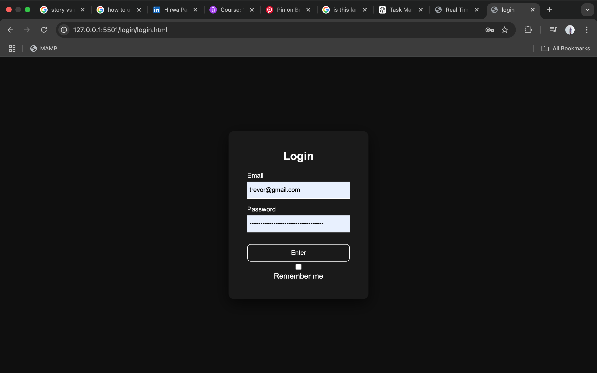
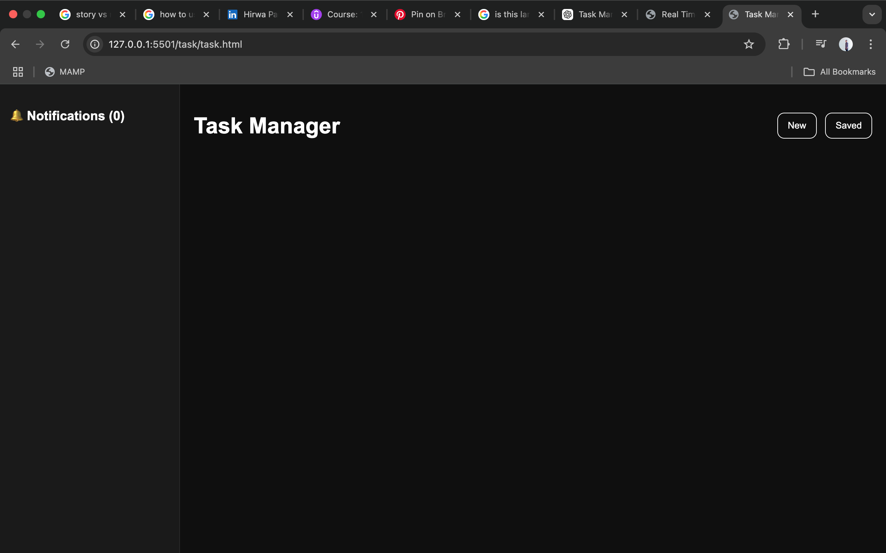

# Task Manager(LEARNING PROJECT)

A full-stack task management application built with Flask and SQLite.

## Features

- User Registration
- User Authentication
- Create Tasks
- View Tasks
- Update Tasks
- Delete Tasks
- Mark Tasks as Completed
- Token-based Authentication

## Tech Stack

### Backend
- Python
- Flask
- SQLite

### Frontend
- HTML
- CSS
- JavaScript

## Screenshots

### Login



### Dashboard


### Create Task



## Installation

Clone the repository:

```bash
git clone <repo-url>
